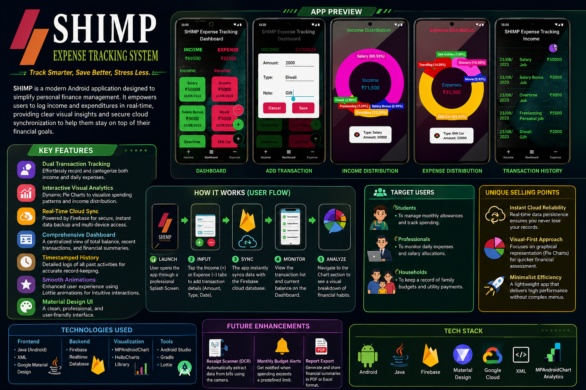

# 💰 SHIMP - Expense Tracking System

<p align="center">
  
</p>

**SHIMP Expense Tracking System** is a powerful and intuitive Android application designed to help users manage their finances effectively. Built with a focus on real-time data synchronization and visual analytics, it provides a seamless experience for tracking daily income and expenses.

---

## 🌟 Key Features

### 📊 Real-Time Dashboard
*   **Dynamic Balance Tracking:** Instantly see your total balance, updated in real-time as you log transactions.
*   **Income & Expense Summary:** A clean overview of your financial status on the main screen.
*   **Interactive Navigation:** Easy access to specialized sections for Income, Dashboard, and Expenses via the Bottom Navigation Bar.

### 📈 Advanced Visual Analytics
*   **Interactive Charts:** Utilizes **MPAndroidChart** and **HelloCharts** to provide beautiful Pie Charts that visualize spending habits and income sources.
*   **Category Breakdown:** See exactly where your money goes with clear, color-coded data representations.

### ☁️ Cloud Synchronization
*   **Firebase Integration:** Powered by **Firebase Realtime Database**, ensuring your data is securely stored in the cloud and synced across devices instantly.
*   **Reliable Persistence:** Never lose your financial records, even if if you switch devices.

### 🎨 Modern User Experience
*   **Lottie Animations:** High-quality, smooth animations for a more engaging and responsive interface.
*   **Material Design:** Follows Google's Material Design guidelines for a professional and clean look.

---

## 🛠️ Technical Stack

*   **Language:** Java (JDK 8+)
*   **UI Framework:** Android XML with Material Design Components
*   **Database:** Firebase Realtime Database (Cloud-based storage)
*   **Animations:** Lottie for Android
*   **Charts:** 
    *   `MPAndroidChart`
    *   `HelloCharts Library`
*   **Minimum SDK:** API 21 (Android 5.0 Lollipop)
*   **Target SDK:** API 33 (Android 13)

---

## 📂 Project Structure

```text
com.example.expensetrackersystem/
├── adapter/          # RecyclerView Adapters (e.g., expenseAdapter)
├── model/            # Data Models for Income and Expenses
├── MainActivity.java # Main navigation and fragment management
├── SplashScreen.java # Professional entry screen
├── PieChart.java     # Logic for visual data representation
└── PieChartIncome.java # Specialized logic for income analytics
```

---

## 🚀 Future Roadmap
- [ ] **Advanced Categorization:** Custom user-defined categories for better tracking.
- [ ] **Monthly Reports:** Exportable PDF/Excel reports for deep financial audits.
- [ ] **Budgeting Mode:** Set monthly limits and receive notifications when nearing thresholds.
- [ ] **Multi-Currency Support:** Track expenses in different global currencies.

---

## ⚙️ Installation & Setup

1.  **Clone the Repository:**
    ```bash
    git clone https://github.com/Harsh172121/SHIMP-Expense-Tracking-System.git
    ```
2.  **Firebase Setup:**
    *   Add your `google-services.json` file to the `app/` directory.
    *   Enable Realtime Database in your Firebase Console.
3.  **Open in Android Studio:**
    *   Import the project and sync Gradle.
4.  **Run:**
    *   Build and run the app on an Android device or emulator.

---
*Developed for smarter financial management.*
